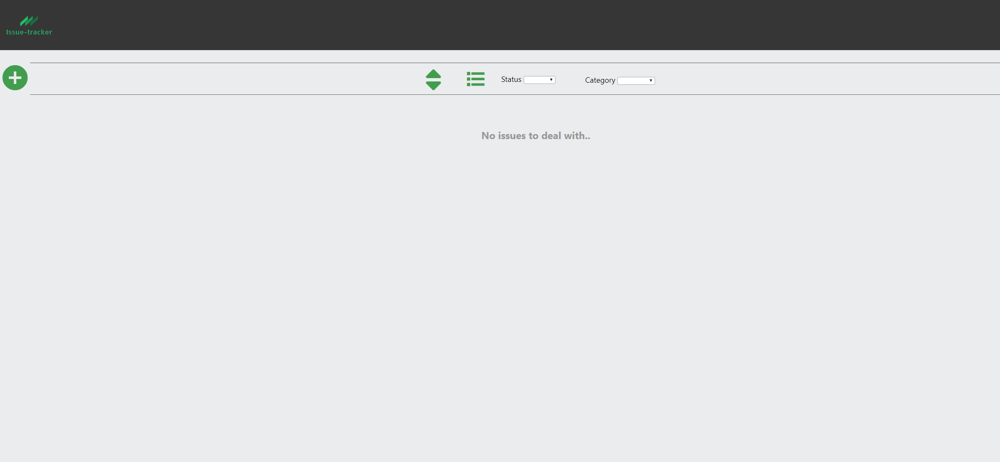
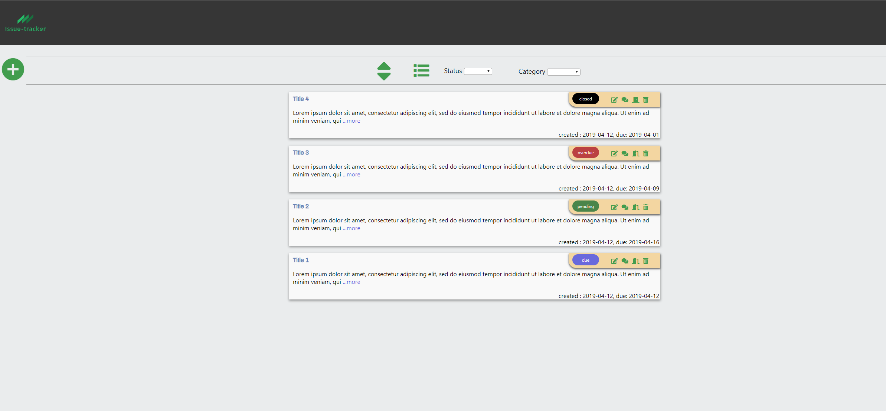
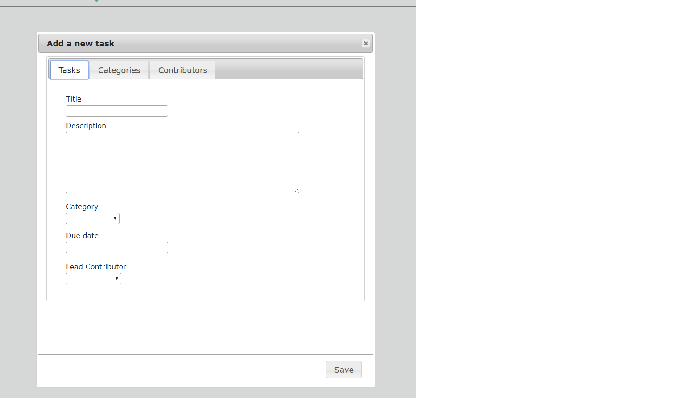
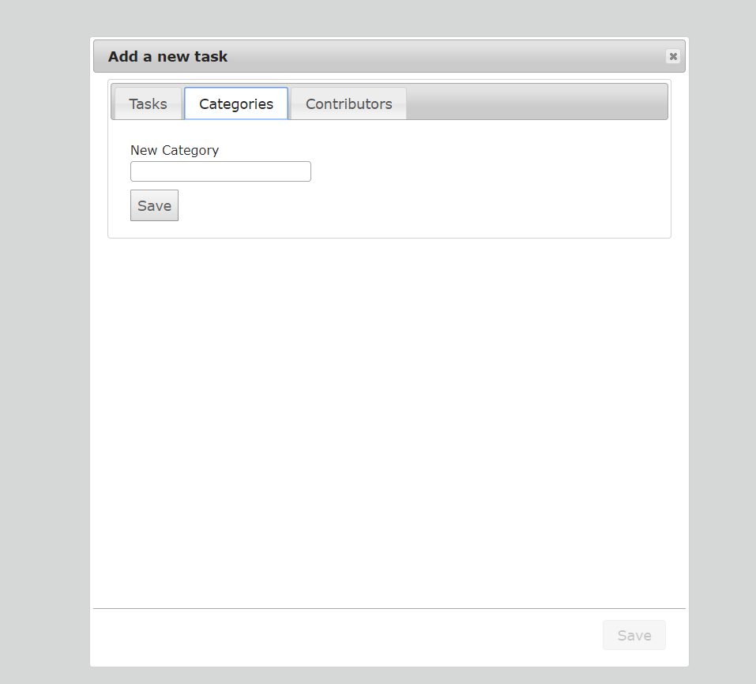

# issue-tracker

## Demo

- [Live Demo](https://tranquil-river-78377.herokuapp.com/)

## Screenshots
Landing Page:

Issues vue:

Add a task view:

Add a category view:

## Summary

1. 'Issue-tracker' is a minimalist tracker of tasks, which can be used by an individual to track his or her own tasks or a small team to serve as a punch list at a meeting to keep track of the tasks at hand.
2. The landing page displays a list of all available tasks if they exist, or a message stating that no tasks have yet been created on first launch or if all tasks were previously deleted.
3. The fields available are : Title, description, Category, Due date and Contributor.
4. Both Category and Contributor are drop down menus which are empty upon first launch of the app, but to which values can be dynamically added later.
5. From the landing page, the user can create a task, order the task list by the date created, and filter two fields, namely: the status and the categories. The status is a calculated value based on the due date and the current date.
6. A status can either be: due, overdue, pending or Closed.
7. Unlike the other statuses which are calculated, the closed status is a boolean value which is stored in the database.
8. Upon creating a task, the task gets displayed at the top of the list.
9. Upon first launch the user has the option to click on both the category and the contributor tabs and create new values before creating a task. 
9. The user has the option of editing a task by changing any of the fields in #3 and committing the changes.
10. To close a task however, the user is given the option to click on an icon to manually close a task. A badge in a toolbar on the top right shows in black background with the word 'Closed'. The user has the ability to re-open a task. 
11. The user is given the option to comment on a task. Multiple comments can be entered and dated and they're listed in Descending order.
12. And finally the user has the option of deleting a task altogether. A confirmation prompt is displayed before the action is executed.

### Technology used
* HTML
* CSS
* JQuery, JQuery UI
* Node.js
* MongoDB (Atlas)
* Mongoose
* Heroku
* git

### API Documentation

- Get all issues: `GET /issues`
  - URL: `/issues`
  - Method: `GET`
  - Code: `200 OK`
  - Content: [{ }]
- Get issue by ID: `GET /issues/:issue_id/`
  - URL: `/issues/:issue_id`
  - Method: `GET`
  - Code: `200 OK`
  - Content: { }
- Get all comments for an issue: `GET /issues/:issue_id/comments`
  - URL: `/issues/:issue_id/comments`
  - Method: `GET`
  - Code: `200 OK`
  - Content: [{ }]
- Get all issues filtered: `GET /issues/filter/:status/:category/:sortcreated`
  - URL: `/issues/filter/:status/:category/:sortcreated`
  - Method: `GET`
  - Code: `200 OK`
  - Content: [{ }]
- Get reopened issue : `GET /issues/:issue_id/reopen`
  - URL: `/issues/:issue_id/reopen`
  - Method: `GET`
  - Code: `200 OK`
  - Content: { }
- Get all contributors: `GET /contributors`
  - URL: `/contributors`
  - Method: `GET`
  - Code: `200 OK`
  - Content: { }
- Get all categories: `GET /categories`
  - URL: `/categories`
  - Method: `GET`
  - Code: `200 OK`
  - Content: { }
- Create an issue: `POST /issues`
  - URL: `/issues`
  - Method: `POST`
  - Code: `201 CREATED`
  - Content: {}
- Create a comment on an issue: `POST /issues/:issue_id/comments`
  - URL: `/issues/:issue_id/comments`
  - Method: `POST`
  - Code: `201 CREATED`
  - Content: {}
- Create a new category: `POST /categories`
  - URL: `/categories/`
  - Method: `POST`
  - Code: `201 CREATED`
  - Content: {}
- Create a new contributor: `POST /contributor`
  - URL: `/contributor`
  - Method: `POST`
  - Code: `201 CREATED`
  - Content: {}
- Edit an issue: `PUT /issues/:issue_id`
  - URL: `/issues/:issue_id`
  - Method: `PUT`
  - Code: `201 CREATED`
  - Content: {}
- Edit a status: `PUT /issues/:issue_id/status/:status`
  - URL: `/issues/:issue_id/status/:status`
  - Method: `PUT`
  - Code: `201 CREATED`
  - Content: {}
- Delete an issue : `DELETE '/issues/:issue_id'`
  - URL: `/issues/:issue_id`
  - Method: `DELETE`
  - Code: `200 OK`
  - Content: {}
